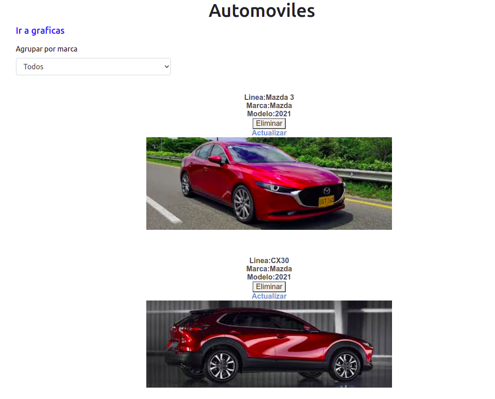

## React Vehiculos
 
 This app is able to create, edit, delete and update vehicles, including the brand, line of vehicle, color, year and image. This project uses react, redux, and fetch and push information to a backend project developed in NodeJs.

 

### Setup

- Run $npm install   -to install all dependencies from a package.json file
- Run on the command line: $npm start
- You will see the project on broswer
- [http://localhost:3000](http://localhost:3000) to view it in the browser.

The page will reload if you make edits. 
You will also see any lint errors in the console.

## Prerequisite
npm 6.14.10
node v14.15.4

## Built with

React 16.13.1
Redux 4.0.5
react-bootstrap 1.3.0
axios 0.19.2

## Live Demo

[Live Demo Link](https://react-vehiculos.herokuapp.com)

## Author:
👤 **Gonza Javier Mancilla**

- Github: [@gonjavi](https://github.com/gonjavi)
- Linkedin: [@g-javier-mancilla](https://www.linkedin.com/in/g-mancillla)

## 🤝 Contributing

Contributions, issues and feature requests are welcome!

## Show your support

Give a ⭐️ if you like this project!

## 📝 License

This project is [MIT](lic.url) licensed.

